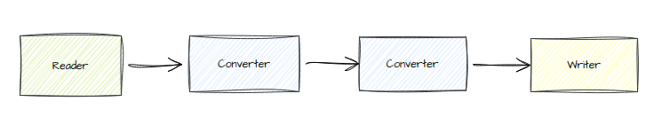

# Toolset

This contains the python code that will be executed from within the DAGs.

## Node Mindmodel

The idea behind this toolset is to provide a set of tools that can basically be plugged in a sequence. Each tool gets a pyarrow table as input and returns a pyarrow table as output. Exceptions are the tools from the "reader" and "parser" group:

- The reader tools don't have an input. They have to be the start point of a sequence. _They don't necessarily output a pyarrow table, see the next point_
- The parse tools don't except a pyarrow table as input but instead they convert a file stream _to_ a pyarrow table.

Following is an abstract example of a very simple chain of tools:

Tools can be parametrizable, for instance a converter tool might need to know the column it needs to operate on.

## `node_tree/`

This folder contains a tool that creates a sequence of tools by parsing a yaml file. This makes it possible to define a pipeline with a configuration instead of having to hard code it into a DAG. See [pipeline_configuration](../)
